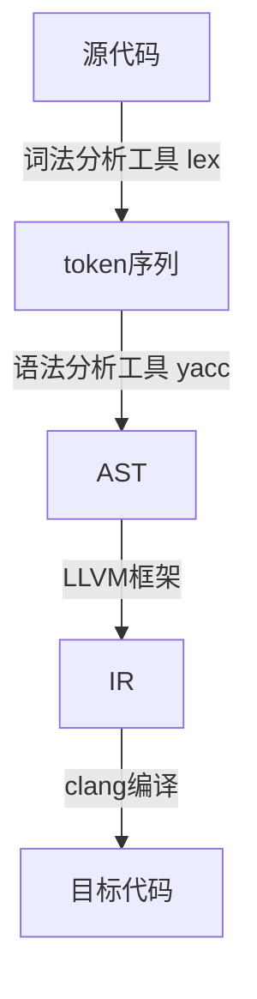
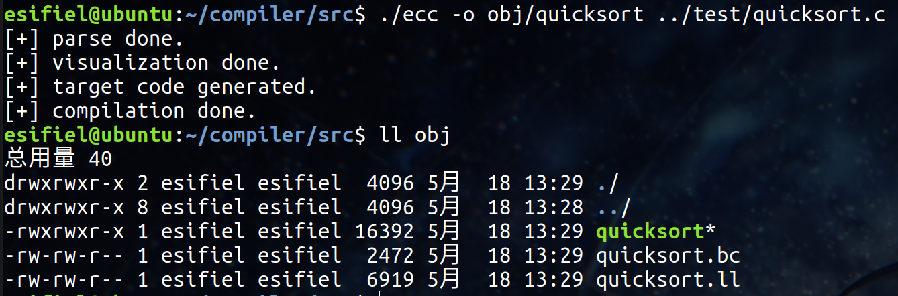
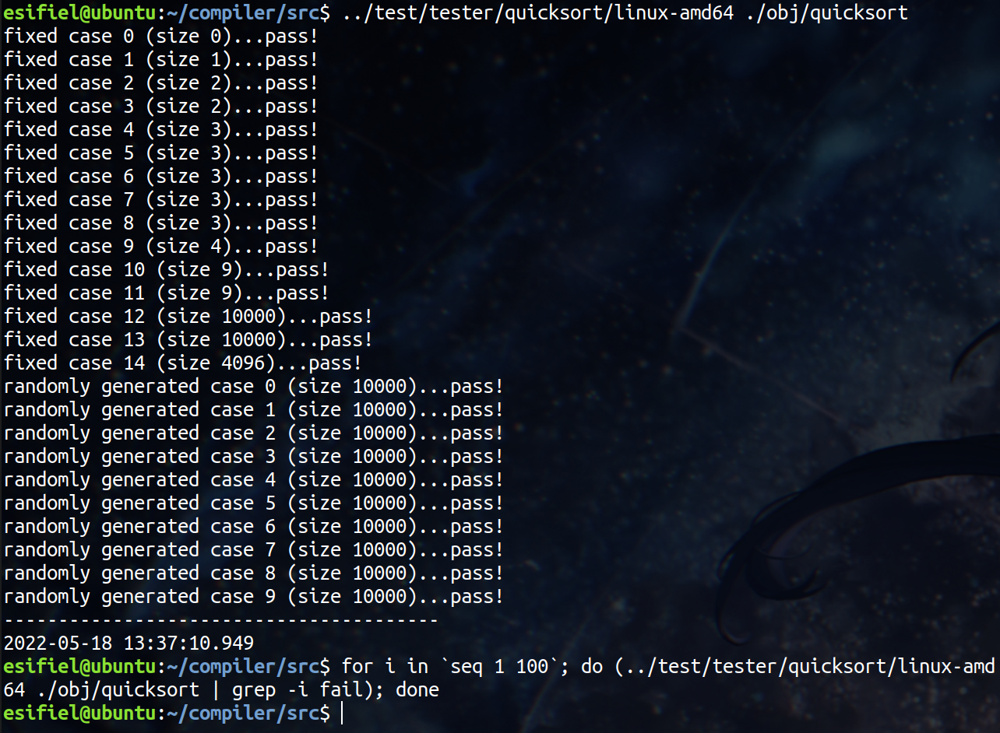
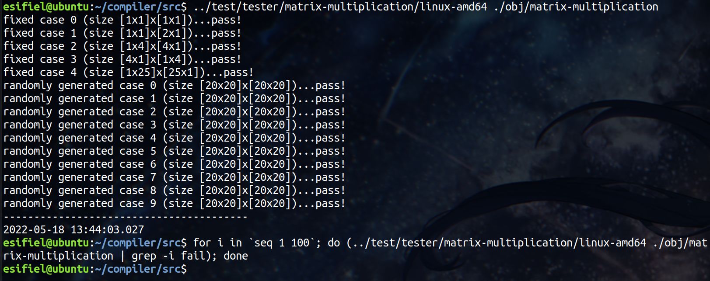
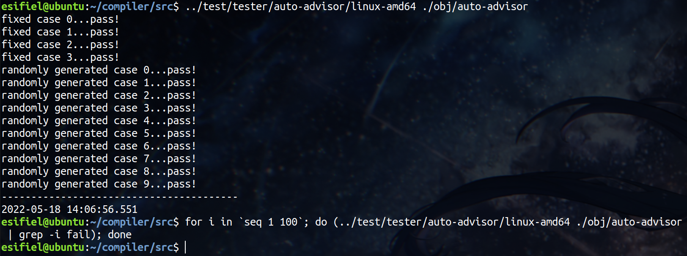

<p style="text-align: center; font-weight: bold; font-size: 24px;">《编译原理》课程实验报告</p>

---

小组人数：1人

组员姓名：颜尔汛

组员学号：3190106216

---

目录：

[toc]

## 一、序言

### 1.1 概述

本实验要求实现一个现代高级语言的编译器，我实现的编译器能够解析C语言语法的子集，并生成能够在目标机上运行的二进制程序。其工作流程如下：



### 1.2 开发环境

操作系统：Ubuntu 20.04 for x86-64

编译器实现部分：

- 编程语言：C++(11)
- 依赖工具：flex 2.6.4，bison 3.5.1，llvm 10.0.0

AST可视化部分：

- 编程语言：C++(11)，Python(3.8.10)
- 依赖第三方库：graphviz 0.19.2

### 1.3 代码说明

#### 1.3.1 源码目录结构

```
.
├── Dockerfile
├── README.md
└── src
    ├── ast
    │   ├── basic.hpp
    │   ├── declaration.hpp
    │   ├── expression.hpp
    │   ├── program.hpp
    │   ├── statement.hpp
    │   └── type.hpp
    ├── codegen
    │   ├── codegen.cpp
    │   ├── codegen.hpp
    │   ├── declaration.cpp
    │   ├── expression.cpp
    │   ├── program.cpp
    │   ├── statement.cpp
    │   └── type.cpp
    ├── ecc.l
    ├── ecc.y
    ├── macro
    │   ├── macro.cpp
    │   └── macro.hpp
    ├── main.cpp
    ├── Makefile
    └── utils
        ├── json2dot.py
        ├── visualizer.cpp
        └── visualizer.hpp
```

- `ecc.l`和`ecc.y`分别为词法分析文件和语法分析文件
- `main.cpp`为编译器主入口
- `ast`目录下文件均为抽象语法树的节点类型定义
- `codegen`目录下文件均用于生成中间代码
- `utils`目录下文件均用于AST可视化
- `macro`目录下为解析宏语法的实现

`Dockerfile`用于构建可以编译本实验代码的环境，方便测试

#### 1.3.2 代码运行

在代码根目录下执行`docker build -t test .`生成名为`test`的镜像，运行`docker run -it /bin/bash`进入docker，执行`make`即可编译生成名为`ecc`的编译器程序。

运行`./ecc FILENAME`（FILENAME为合法的C源代码文件），会自动编译生成名为`a.out`的可执行文件。如果不想使用默认的名字，可以用`-o`参数指定输出文件名；还可以使用`-E`选项输出宏展开后的源文件。例如`./ecc src.c -o src -E src.i`（用法均同gcc）

编译器在生成AST后会将结果写为一个json文件，如果需要查看AST的可视化效果，可以在`src`目录下执行`python3 utils/json2dot.py <json filename>`生成对应的可视化png图片

#### 1.3.3 版本控制与代码风格

实验全程使用`git`进行版本控制，仓库地址：https://github.com/Esifiel/compiler。此仓库于实验验收结束之后公开，此前均处于`private`状态

截至2022年5月30日，仓库共有59个commit

在代码风格上，

1. 如1.3.1节所示，对于每一种不同的语法树节点都进行了模块的分割，并且再细分为AST定义和中间代码生成两个不同的方面
2. 在各个模块中，命名规则基本遵循：变量名全小写、函数名除第一个单词外首字母大写、类名单词全首字母大写

## 二、词法分析

> 从第二节开始，为了篇幅简洁，所有讲述实现的章节中只贴出部分实现用于举例，**不代表同类型的其他内容没有实现**，完整实现详见附件

### 2.1 概述

词法分析器是从源代码生成token序列的中间程序。本编译器的词法分析部分借助lex实现。

### 2.2 token的正则表达式描述

#### 2.2.1 C语言关键字

|    类型    |                            关键字                            |
| :--------: | :----------------------------------------------------------: |
|  类型定义  | "char"，"short"，"int"，"long"，"float"，"double"<br>"struct"，"enum"，"union"，"void"，"unsigned"，"signed" |
| 存储修饰符 |            "auto"，"register"，"extern"，"static"            |
|  跳转语句  | "switch"，"else"，"if"，"break"，"return"<br>"continue"，"goto"，"case"，"default" |
|  循环语句  |                     "for"，"do"，"while"                     |
| 类型修饰符 |                     "const"，"volatile"                      |
|    其他    |                     "typedef"，"sizeof"                      |

#### 2.2.2 数据表示

|       类型       |            正则表达式            |
| :--------------: | :------------------------------: |
|   十进制长整数   |      -?(0\|(\[1-9][0-9]*))       |
|   八进制长整数   |            -?0[0-7]*             |
|  十六进制长整数  |       -?0\[xX][0-9a-fA-F]+       |
|   双精度浮点数   | -?(0\|(\[1-9][0-9]*))(\.[0-9]+)? |
|      标识符      |     \[A-Za-z\_][A-Za-z0-9_]*     |
|     常规字符     |             \\'.\\'              |
|     转义字符     |   \\'\\\[abfnrtv\\'\\"\\\]\\'    |
|  八进制表示字符  |       \\'\\\0[0-7]{1,3}\\'       |
| 十六进制表示字符 |   \\'\\\x\[0-9a-fA-F]{1,2}\\'    |
|    字符串常量    |    (\\"(\[^"]\|\\\\\\")*\")+     |

#### 2.2.3 运算符

|    类型    |                            运算符                            |
| :--------: | :----------------------------------------------------------: |
| 算术运算符 |             "+"，"-"，"*"，"/"，"%"，"++"，"--"              |
|  位运算符  |               "&"，"\|"，"~"，"^"，"<<"，">>"                |
| 逻辑运算符 |                      "&&"，"\|\|"，"!"                       |
| 赋值运算符 | "="，"+="，"-="，"*="，"/="，"%="，"&="，"\|="，"^="，"<<="，">>=" |
| 关系运算符 |               "<"，">"，"<="，">="，"!="，"=="               |
|    其他    | "?"，":"（条件表达式），","（逗号运算符）<br>"."（结构体成员访问），"->"（结构体指针访问）<br>"&"（取地址），"*"（解引用），"sizeof"（取类型大小）<br>"("，")"（强制类型转换），"["，"]"（下标访问） |

#### 2.2.4 注释及其他

|                                       |     说明     |
| :-----------------------------------: | :----------: |
|                  ";"                  |   语句结尾   |
|                 "..."                 | 可变参数标志 |
|               "{"，"}"                | 复合语句标志 |
|                [ \t\n]                |    空白符    |
|                "//".*                 |   单行注释   |
| "/\*"(\[\^\*]\|"\*"+\[^/\*])\*"*"+"/" |  可跨行注释  |
|                 \\\\$                 |    续行符    |

### 2.3 词法分析器具体实现

大多数token被正则表达式匹配到时，都直接返回对应的标识符，交由语法分析器进一步处理，例如：

```c
"double"                        { return DOUBLE; }
"int"                           { return INT; }
"struct"                        { return STRUCT; }
```

对于数值常量，需要使用`strtol`函数转为对应的数值并存入yylval：

```c
-?0[0-7]*                       {
                                    debug();
                                    yylval.num.longValue = strtol(yytext, NULL, 8);
                                    return NUMLONG;
                                }
-?0[xX][0-9a-fA-F]+             {
                                    debug();
                                    yylval.num.longValue = strtol(yytext, NULL, 16);
                                    return NUMLONG;
                                }
-?(0|([1-9][0-9]*))(\.[0-9]+)?  {
                                    debug();
                                    yylval.num.doubleValue = atof(yytext);
                                    return NUMDOUBLE;
                                }
```

> yylval.num是一个union类型的值，具体定义见第三节

对于字符或字符串常量，主要是需要对转义字符进行处理，我自己实现了一个replace函数，用于对转义字符文本进行替换：

```
\'\\x[0-9a-fA-F]{1,2}\'         {
                                    // hexidecimal char
                                    debug();
                                    yytext[strlen(yytext) - 1] = '\0';
                                    yylval.num.charValue = strtol(yytext + 3, NULL, 16);
                                    return NUMCHAR;
                                }
(\"([^"]|\\\")*\")+             {
                                    // string const
                                    debug();
                                    // strip "
                                    yylval.stringValue = new string(string(yytext).substr(1, strlen(yytext) - 2));
                                    // multiple strings will be combined
                                    replace(*yylval.stringValue, "\"\"", "");
                                    // translate escape char
                                    replace(*yylval.stringValue, "\\a", "\a");
                                    replace(*yylval.stringValue, "\\b", "\b");
                                    replace(*yylval.stringValue, "\\f", "\f");
                                    replace(*yylval.stringValue, "\\n", "\n");
                                    replace(*yylval.stringValue, "\\r", "\r");
                                    replace(*yylval.stringValue, "\\t", "\t");
                                    replace(*yylval.stringValue, "\\v", "\v");
                                    replace(*yylval.stringValue, "\\\"", "\"");
                                    replace(*yylval.stringValue, "\\'", "'");
                                    replace(*yylval.stringValue, "\\\\", "\\");
                                    return STRING;
                                }
```

如果是空白字符、注释或续行符，就都忽略：

```c
[ \t\n]                         {}
"//".*                          {}
"/*"([^*]|"*"+[^/*])*"*"+"/"    {}
\\$                             {}
```

### 2.4 结果示例


## 三、语法分析与AST生成

### 3.1 概述

语法分析器的作用是解析token序列，判断程序的语法结构是否符合语法规则，并为程序构建语法树。本编译器的语法分析部分借助yacc实现。本实验中所有C语言相关语法的地方均指ANSI C（即标准C、C89），不涉及后续标准如C99等添加的新语法。

### 3.2 AST节点定义

这一节描述代码中`ast`目录下的各个头文件，主要涉及各种节点的类定义

#### 3.2.1 basic.hpp

在`basic.hpp`中定义了最基本的AST节点`Node`类：

```c++
class Node
{
public:
    Node() {}
    virtual string getName() = 0;
    virtual llvm::Value *codeGen(CodeGenerator &context) { return nullptr; };
};
```

其中，

- `getName`方法返回节点对应的名称
- `codeGen`方法用于生成节点对应的中间代码

> CodeGenerator类为自定义类，用于中间代码生成，Value类为llvm内部类，具体定义与说明见第四节

此外，还需要定义一些标记操作符、值类型和类型的枚举值，方便后续代码的编写：

```c++
enum op_type { OP_NONE, OP_EQ, OP_ADD, OP_ADDRESSOF, OP_ASSIGN, OP_COMMA, OP_INDEX, ... };
enum val_type { VAL_NONE, VAL_CHAR, ... };
enum type_type { TYPE_NONE, TYPE_CHAR, TYPE_STRUCT, TYPE_ARRAY, TYPE_QUALIFIER, ... };
```

其中需要说明的是，`OP_NONE`在后续代码中用于表示一个叶表达式，即一个常量或标识符，不需要解析操作符。

#### 3.2.2 type.hpp

`type.hpp`负责定义语言的类型系统。

首先需要说明的是，在C语言中定义一个变量时，标识符前可能会由多个部分组成，比如`static const unsigned int *p;`。从C语言语法的角度来看：

- 基本类型名（如int、double，包括unsigned和signed前缀）以及用户自定义的类型名（struct a，union b，enum c以及typedef定义的别名）称为"Type"
- const、volatile称为"Qualifier"，即类型描述符
- static等描述变量作用范围的称为存储描述符，我认为也可以算是"Qualifier"的一部分
- "Qualifier"和"Type"是同级的，但是指针描述符`*`是和标识符（Identifier）同级的，这也是为什么`int *p, q;`定义的q是int类型，`int *p, *q;`定义的q才是一个int的指针

为了将`*`所描述的指针类型和其他描述符都加入"Type"中，我在实现的时候除了为"类型"定义了`TypeSpecifier`类，同时为了顺应语法标准还定义了`Qualifier`类，并且为`Identifier`类（见3.2.3节）也定义了`Qualifier`类的成员，但最终这些信息都会集中到`TypeSpecifier`对象中，`Qualifier`类只是作为一个中间产物，不参与中间代码生成。

##### 3.2.2.1 类型系统基类

`Qualifier`类定义：

```c++
class Qualifier : public Node
{
public:
    bool isconst, isvolatile;
    uint64_t pcnt;

    Qualifier() : isconst(false), isvolatile(false), pcnt(0) {}
    Qualifier(uint64_t i) : isconst(false), isvolatile(false), pcnt(i) {}

    virtual string getName() { return "\"Qualifier\""; }
};
```

其中，

- `isconst`，`isvolatile`标记该类型是否有对应的修饰
- `pcnt`记录指针的级别，即类型定义中`*`的个数

> isvolatile字段是出于扩展考虑加入的，在本实验中目前暂未实现volatile关键字

`TypeSpecifier`类定义：

```c++
class TypeSpecifier : public Node
{
public:
    enum type_type type;
    bool isunsigned;
    Qualifier *qual;

    TypeSpecifier(enum type_type t) : type(t), isunsigned(false), qual(nullptr) {}
    TypeSpecifier(enum type_type t, Qualifier *q) : type(t), isunsigned(false), qual(q) {}

    virtual string getName() { return "\"TypeSpecifier\""; }
    virtual Type *getType(CodeGenerator &ctx) = 0;
    virtual TypeSpecifier *getRootType() = 0;
    virtual uint64_t getSize() = 0;
    virtual bool isAggregateType() = 0;
    virtual bool isIterableType() = 0;
};
```

`TypeSpecifier`类的成员变量最终会包含所有的类型定义信息。除此之外，关于几个成员函数的说明：

- `getType`方法用于返回该类型在LLVM中的对应描述，类型为`llvm::Type *`，具体定义见第四节
- `getRootType`方法用于返回该类型的基本类型，用于获取数组或指针
- `getSize`方法返回该类型的大小，用于实现`sizeof`运算符
- `isAggregateType`方法返回该类型是否是一个聚合类型，即是否是结构体或联合体
- `isIterableType`方法返回该类型是否是一个可枚举类型，即是否是数组或指针

##### 3.2.2.2 基本类型

以int类型为例：

```c++
class IntType : public TypeSpecifier
{
public:
    IntType() : TypeSpecifier(TYPE_INT) {}
    IntType(Qualifier *q) : TypeSpecifier(TYPE_INT, q) {}

    virtual string getName() { return "\"IntType\""; }
    virtual TypeSpecifier *getRootType() { return this; }
    virtual uint64_t getSize() { return sizeof(int); }
    virtual bool isAggregateType() { return false; }
    virtual bool isIterableType() { return false; }
};
```

##### 3.2.2.3 数组与指针

数组和指针都继承自可枚举类型，其定义如下：包含一个基本类型`basictype`

```c++
class IterableType : public TypeSpecifier
{
public:
    TypeSpecifier *basictype;

    IterableType(TypeSpecifier *bt, enum type_type type) : basictype(bt), TypeSpecifier(type) {}

    virtual TypeSpecifier *getRootType() { return basictype->getRootType(); }
    virtual bool isAggregateType() { return false; }
    virtual bool isIterableType() { return true; }
};
```

数组类型：继承自`IterableType`，需要再多一个成员变量`size`表示大小。同时`getSize`方法的实现也有别于指针类型，其值为数组大小 * 基本类型大小

```c++
class MyArrayType : public IterableType
{
public:
    uint64_t size;

    MyArrayType(TypeSpecifier *t) : IterableType(t, TYPE_ARRAY), size(0) {}
    MyArrayType(TypeSpecifier *t, uint64_t sz) : IterableType(t, TYPE_ARRAY), size(sz) {}

    virtual string getName() { return "\"MyArrayType\""; }
    virtual uint64_t getSize() { return size * basictype->getSize(); }
};
```

##### 3.2.2.4 结构与联合

结构体与联合体都继承自聚合类型，其定义如下：包含此类型声明的各个成员信息

```c++
class AggregateType : public TypeSpecifier
{
public:
    string name;
    vector<pair<vector<TypeSpecifier *> *, vector<Identifier *> *> *> *members;

    AggregateType(enum type_type t) : name(""), members(nullptr), TypeSpecifier(t) {}

    virtual string getName() { return "\"AggregateType\""; }
    virtual bool isAggregateType() { return true; }
    virtual bool isIterableType() { return false; }
    pair<TypeSpecifier *, Identifier *> getMemberDef(Identifier *id);
};
```

成员信息统一用`members`变量记录，该成员类型比较复杂，之所以定义中全是指针是为了方便AST的构建，其表示的是一系列（类型，标识符）对的数组。以下面的结构体定义为例：

```c
struct st {
	int a, *b;
    long c;
    double d;
}
```

该结构体成员在`members`中记录为如下结构：

```
vector {
	(
		vector { IntType     , MyPointerType },
		vector { Identifier a, Identifier b  }
	),
	(LongType,   Identifier c),
	(DoubleType, Identifier d)
}
```

`getMemberDef`方法是一个辅助函数，用于返回一对结构体或联合体中的成员声明，包括类型与标识符

##### 3.2.2.5 枚举量

枚举类型包括一个类型名称和一系列枚举量`Enumerator`：

```c++
class Enumerator {
public:
    string name;
    int val;
    bool hasinit;

    Enumerator(string s) : name(s), val(0), hasinit(false) {}
    Enumerator(string s, int v) : name(s), val(v), hasinit(true) {}
};

class EnumType : public TypeSpecifier
{
public:
    string name;
    vector<Enumerator *> *enumlist;

    EnumType() : name(""), TypeSpecifier(TYPE_ENUM) {}
    EnumType(string s) : name(s), enumlist(nullptr), TypeSpecifier(TYPE_ENUM) {}
    EnumType(vector<Enumerator *> *e) : name(""), enumlist(e), TypeSpecifier(TYPE_ENUM) {}
    EnumType(string s, vector<Enumerator *> *e) : name(s), enumlist(e), TypeSpecifier(TYPE_ENUM) {}

    virtual TypeSpecifier *getRootType() { return this; }
    virtual uint64_t getSize() { return sizeof(int); }
};
```

按照C语言的语法，枚举量的值从0开始递增，且可以自定义初始值、后续的值以这个值为基础继续递增。因此在语法分析时会按照这个规则记录枚举值：

```c++
int cur = 0;
for(auto &p : enumtype->enumlist)
{
    if(enumvalue.find(p->name) != enumvalue.end())
        yyerror("redefinition of enumerator '" + p->name + "'");
    if(p->hasinit)
        cur = p->val;
    enumvalue[p->name] = cur;
    cur++;
}
```

由于枚举值相当于32位有符号int常量，因此在生成AST时就可以将用到枚举值的地方直接替换成对应的常数，同时在codegen时遇到枚举类型的值定义也可以直接生成为`Int32`类型，例如：函数声明`void f(enum e arg)`会被解析为`void f(int arg)`

此外，gcc是不允许枚举量的递增上溢的，此时会报错。但是我的实现不对这种情况做处理，即对于一个赋值为0x7fffffff（2147483647）的32位有符号int值，下一个枚举量的值将会是0x80000000（-2147483648）

#### 3.2.3 expression.hpp

`expression.hpp`负责定义表达式节点。

##### 3.2.3.1 表达式基类

通用`Expression`节点定义如下：

```c++
class Expression : public Node
{
public:
    Expression *left;
    Expression *right;
    Expression *addition;
    enum op_type op;
    TypeSpecifier *type;

    // terminal expr
    Expression() : left(nullptr), right(nullptr), addition(nullptr), op(OP_NONE), type(nullptr) {}
    // unary expr
    Expression(Expression *l, enum op_type o) : left(l), right(nullptr), addition(nullptr), op(o), type(nullptr) {}
    // binary expr
    Expression(Expression *l, Expression *r, enum op_type o) : left(l), right(r), addition(nullptr), op(o), type(nullptr) {}
    // trinary expr
    Expression(Expression *l, Expression *r, Expression *a, enum op_type o) : left(l), right(r), addition(a), op(o), type(nullptr) {}
    // for type casting
    Expression(TypeSpecifier *t) : left(nullptr), right(nullptr), addition(nullptr), op(OP_NONE), type(t) {}

    virtual string getName() { return "\"Expression\""; }
    virtual llvm::Value *codeGen(CodeGenerator &ctx);
};
```

其中包含五个构造函数，不接受任何参数的用于`Identifier`和`Number`等叶表达式节点，接受一、二、三个子表达式节点的分别用于单目、双目、三目表达式的构建，接受一个类型参数的用于强制类型转换表达式

##### 3.2.3.2 数值常量

该类实际上是对一个8字节内存空间按照不同类型进行解读：

```c++
class Number : public Expression
{
public:
    uint8_t buf[8];
    enum val_type valtype;

    Number() : valtype(VAL_NONE) {}
    Number(union union_num u, TypeSpecifier *t, enum val_type v) : Expression(t), valtype(v) { memcpy(buf, &u, 8); }

    virtual string getName() { return "\"Number\""; }

    uint8_t charView() { return *(uint8_t *)buf; }
    uint16_t shortView() { return *(uint16_t *)buf; }
    uint32_t intView() { return *(uint32_t *)buf; }
    uint64_t longView() { return *(uint64_t *)buf; }
    float_t floatView() { return *(float_t *)buf; }
    double_t doubleView() { return *(double_t *)buf; }
};
```

##### 3.2.3.3 标识符

标识符可以拥有初始化表达式`init`，同时也包含可能存在的指针描述符`qual`

```c++
class Identifier : public Expression
{
public:
    string name;
    Expression *init;
    Qualifier *qual;

    Identifier(string v) : name(v), init(nullptr), qual(nullptr) {}
    Identifier(string v, Expression *ini) : name(v), init(ini), qual(nullptr) {}

    virtual string getName() { return "\"Identifier\""; }
};
```

##### 3.2.3.4 函数调用

函数调用包含调用函数名`name`和一个参数表达式列表`varlist`：

```c++
class FunctionCall : public Expression
{
public:
    Expression *name;
    vector<Expression *> *varlist;

    FunctionCall(Expression *n, vector<Expression *> *l) : name(n), varlist(l) {}

    virtual string getName() { return "\"FunctionCall\""; }
};
```

#### 3.2.4 statement.hpp

`statement.hpp`负责定义各种语句节点。

##### 3.2.4.1 语句基类

通用`Statement`节点定义如下：

```c++
class Statement : public Node
{
public:
    Statement *tail;
    Statement *next;

    Statement() : tail(nullptr), next(nullptr) {}

    virtual string getName() { return "\"Statement\""; }
};
```

`Statement`节点在AST中是用left-child-right-sibling方法表示的，因此每个节点只需要指向下一条语句的指针`next`即可。由于一个语句链的最后一条语句也是很常用的，因此这里我还加了一个`tail`指针，方便快速定位

##### 3.2.4.2 复合语句

在ANSI C语法中，复合语句可以**按序**包含两个内容：首先是一系列变量或类型声明`decl`，然后是一系列子语句`stmt`：

```c++
class CompoundStatement : public Statement
{
public:
    Declaration *decl;
    Statement *stmt;

    CompoundStatement(Declaration *d, Statement *s) : decl(d), stmt(s) {}

    virtual string getName() { return "\"CompoundStatement\""; }
    virtual llvm::Value *codeGen(CodeGenerator &ctx);
};
```

##### 3.2.4.3 表达式语句

表达式语句即一个以分号结尾的、包含一个表达式（可以为空）`expr`成员的语句：

```c++
class ExpressionStatement : public Statement
{
public:
    Expression *expr;

    ExpressionStatement() : expr(nullptr) {}
    ExpressionStatement(Expression *e) : expr(e) {}

    virtual string getName() { return "\"ExpressionStatement\""; }
};
```

##### 3.2.4.4 选择语句

选择语句的基本成员包括一个条件表达式`cond`和满足条件时执行的语句链`stmt`：

```c++
class SelectionStatement : public Statement
{
public:
    Expression *cond;
    Statement *stmt;

    SelectionStatement(Expression *c, Statement *s) : cond(c), stmt(s) {}

    virtual string getName() { return "\"SelectionStatement\""; }
};
```

选择语句有两种：if-else语句和switch-case语句。对于if-else语句而言，`stmt`成员表示的语句链是if子句的内容和else子句的内容；对于switch-case语句而言，`stmt`成员表示的语句链是各个case语句。

##### 3.2.4.5 迭代语句

迭代语句（即循环语句）的基本成员包括一个循环条件`cond`和满足条件时执行的语句链`stmt`：

```c++
class IterationStatement : public Statement
{
public:
    Expression *cond;
    Statement *stmt;

    IterationStatement(Expression *c, Statement *s) : cond(c), stmt(s) {}

    virtual string getName() { return "\"IterationStatement\""; }
};
```

循环语句有三种：while语句、do-while语句和for语句。对于前两者，只需要上述两个成员即可表示，对于for语句，还需要额外的初始化表达式`init`和每一轮循环后都执行的表达式`end`：

```c++
class ForStatement : public IterationStatement
{
public:
    Expression *init;
    Expression *end;

    ForStatement(Expression *i, Expression *c, Expression *e, Statement *s) : init(i), IterationStatement(c, s), end(e) {}

    virtual string getName() { return "\"ForStatement\""; }
};
```

##### 3.2.4.6 跳转语句

跳转语句包括return语句、break语句、continue语句，goto语句

return语句有一个表达式成员`res`，该成员可以为空：

```c++
class ReturnStatement : public Statement
{
public:
    Expression *res;

    ReturnStatement() : res(nullptr) {}
    ReturnStatement(Expression *r) : res(r) {}

    virtual string getName() { return "\"ReturnStatement\""; }
};
```

break语句和continue语句不需要额外的成员变量，在中间代码生成时会根据上下文进行实现。

goto语句需要一个string成员`name`指明要跳转的标签：

```c++
class GotoStatement : public Statement
{
public:
    string label;

    GotoStatement(string s) : label(s) {}

    virtual string getName() { return "\"GotoStatement\""; }
};
```

##### 3.2.4.7 标签语句

标签语句包括case语句和标签定义。

case语句的开关值必须是一个`Number`类型的数值常量：

```C++
class CaseStatement : public Statement
{
public:
    Number *val;

    CaseStatement(Number *e) : val(e) {}

    virtual string getName() { return "\"CaseStatement\""; }
};
```

需要说明的是，在本实验中，为了方便起见，认为case语句的含义仅限于case本身，不包括后续的子语句，所以`CaseStatement`类没有`Statement`类的成员；同时，由于case语句必须和switch语句配合使用，所以认为case语句下的子语句归switch语句所属，在为switch语句生成中间代码时统一都生成出来。

标签定义包含一个string类型的标签名：

```c++
class LabelStatement : public Statement
{
public:
    string label;

    LabelStatement(string s) : label(s) {}

    virtual string getName() { return "\"LabelStatement\""; }
};
```

#### 3.2.5 declaration.hpp

`declaration.hpp`负责定义各种声明。

##### 3.2.5.1 声明基类

通用`Declaration`节点定义如下，和`Statement`类类似，也是一个链表结构：

```c++
class Declaration : public Node
{
public:
    Declaration *tail;
    Declaration *next;

    Declaration() : tail(nullptr), next(nullptr) {}

    virtual string getName() { return "\"Declaration\""; }
};
```

##### 3.2.5.2 变量声明

变量声明的结构类似结构体的成员定义，也是由`TypeSpecifier`类和`Identifier`类列表组成的序对：

```c++
class VariableDeclaration : public Declaration
{
public:
    vector<TypeSpecifier *> *types;
    vector<Identifier *> *ids;

    VariableDeclaration(vector<TypeSpecifier *> *t, vector<Identifier *> *i) : types(t), ids(i) {}

    virtual string getName() { return "\"VariableDeclaration\""; }
};
```

##### 3.2.5.3 形参声明

函数的形参声明类似变量声明，但是是类型和标识符的一一对应（也有可能只有类型），不存在一个类型对应多个表示符的情况，所以实验中也作为单独一个类来实现：

```c++
class Parameter : public Declaration
{
public:
    TypeSpecifier *type;
    Identifier *id;
    bool isvariableargs;

    Parameter(TypeSpecifier *t) : type(t), id(nullptr), isvariableargs(false) {}
    Parameter(TypeSpecifier *t, Identifier *i) : type(t), id(i), isvariableargs(false) {}

    virtual string getName() { return "\"Parameter\""; }
};
```

在C语言语法中，参数列表的推导能够识别可变参数标识`...`，因此这里还为`Parameter`类加上一个bool类型的变参标志

##### 3.2.5.4 函数声明

函数声明包括四个部分：返回类型`rettype`、函数名`id`、参数列表`params`、函数体`stmts`

```c++
class FunctionDeclaration : public Declaration
{
public:
    TypeSpecifier *rettype;
    Identifier *id;
    Parameter *params;
    CompoundStatement *stmts;

    FunctionDeclaration(TypeSpecifier *t, Identifier *n, Parameter *p, CompoundStatement *s) : rettype(t), id(n), params(p), stmts(s) {}

    virtual string getName() { return "\"FunctionDeclaration\""; }
};
```

##### 3.2.5.5 类型声明

类型声明包含一个`TypeSpecifier`类成员，主要用于非基本类型的声明：

```c++
class TypeDeclaration : public Declaration
{
public:
    TypeSpecifier *type;

    TypeDeclaration() : type(nullptr) {}
    TypeDeclaration(TypeSpecifier *t) : type(t) {}

    virtual string getName() { return "\"TypeDeclaration\""; }
};
```

在构造AST时，如果要声明的类型是一个基本类型，会使用空构造函数，并输出一个warning（按照gcc的逻辑），在生成中间代码时会忽略它

#### 3.2.6 program.hpp

Program节点定义如下：

```c++
class Program : public Node
{
public:
    Declaration *decl;

    Program(Declaration *l) : decl(l) {}

    virtual string getName() { return "\"Program\""; }
    virtual llvm::Value *codeGen(CodeGenerator &ctx);
};
```

Program是整个AST的根节点，一个C源代码程序是由各种声明构成的，所以Program节点的成员是一个指向首个Declaration节点的指针

### 3.3 语法分析器具体实现

#### 3.3.1 yacc源文件定义段说明

- 使用`%expect 1`声明编译器语法只接受一个shift-reduce冲突，即由于if语句可选的else子句造成的冲突。yacc默认执行shift，即if-else的配对遵循就近原则

- 使用`%union { ... }`定义yylval，除了数值常量，都是各个AST节点类的指针

- 使用`%token  ...`定义语法中的终结符

- 使用`%type<...> ...`将yylval中的成员与语法元素绑定

- 使用`%start program`指定语法分析以`program`为start symbol

- 定义AST的根节点`Program *program;`，以及需要用到的一些字典结构：

    ```c++
    map<string, Number *> constvar; // 声明为const的常值变量
    map<string, AggregateType *> aggrdef; // 聚合类型定义
    map<string, TypeSpecifier *> typealias; // typedef定义的类型别名
    ```

#### 3.3.2 ANSI C语法BNF描述

BNF描述参考的是http://www.cs.man.ac.uk/~pjj/bnf/c_syntax.bnf，在实验中略做了一些修改

> 由于完整语法很长，.y文件的内容非常复杂，没有办法很具体的逐条描述，所以下面只对部分语法和AST构建的思路做简单的文字介绍，没有把每条规则具体需要执行的代码贴上来

##### 3.3.2.1 程序结构

一个C语言程序由各种声明组成：函数声明（function-definition）、变量声明（decl）、类型声明（decl）。所有声明构成一个声明列表（translation-unit）

```
program : translation-unit
        ;
translation-unit : external-decl
                 | translation-unit external-decl
                 ;
external-decl : function-definition
              | decl
              ;
```

##### 3.3.2.2 声明

函数声明：在C语言语法中，一个函数定义由三个部分组成：返回类型（decl-specs）、声明符（declarator）、函数体（一个复合语句，compound-stat）。返回类型可以省略，缺省值为int类型

```
function-definition : decl-specs declarator compound-stat
                    |            declarator compound-stat
                    ;
```

变量声明和类型声明：

- 变量声明需要指定变量类型（decl-specs），以及一个声明符列表（init-declarator-list），此列表可能包含多个变量、每个变量可能会有初始化表达式
- 类型声明包含结构体等的定义（decl-specs），或者是通过typedef定义的类型别名（IDENTIFIER）

```
decl : decl-specs init-declarator-list DELIM
	 | decl-specs DELIM
	 | TYPEDEF decl-specs IDENTIFIER DELIM
	 ;
```

声明符（declarator）：用于对一个标识符进行各种描述。同一个类型的变量声明可以写在一个声明符列表（init-declarator-list）中，声明符之间用逗号（COMMA）连接。每个声明符都可以有初始化表达式（initializer）

```
init-declarator-list : init-declarator
					 | init-declarator-list COMMA init-declarator
					 ;
init-declarator : declarator
                | declarator ASSIGN initializer
                ;
```

声明符的修饰包括指针修饰（pointer）和类型修饰（type-qualifier），一个声明符前可以有若干个*（MULORDEREFERENCE），每个\*都可以有自己的类型修饰。

声明符的主体有很多种：

- 普通变量：IDENTIFIER
- 数组：由中括号（LB、RB）包围的常量表达式（const-exp），或者是不带常量表达式，即省略最后一维大小的作为参数的数组
- 函数：由小括号（LP、RP）包围的参数列表（param-type-list，语法类似变量声明），或者没有参数的函数

所有描述性单元最终都会集中到主体的类型定义中。

```
declarator : pointer direct-declarator
		   | direct-declarator
		   ;
direct-declarator : IDENTIFIER
				  | direct-declarator LB const-exp RB
				  | direct-declarator LB RB
				  | direct-declarator LP param-type-list RP
				  | direct-declarator LP RP
				  ;
pointer	: MULORDEREFERENCE type-qualifier-list
		| MULORDEREFERENCE
		| MULORDEREFERENCE type-qualifier-list pointer
		| MULORDEREFERENCE pointer
		;
type-qualifier-list	: type-qualifier
					| type-qualifier-list type-qualifier
					;
```

##### 3.3.2.3 类型

一个类型可以有三个部分：存储修饰符（storage-class-specifier，如extern、static）、主类型（type-spec，如int、double、struct st）、类型修饰符（type-qualifier，如const），并且主类型可以省略，缺省值为int类型

```
decl-specs : storage-class-specifier
		   | storage-class-specifier decl-specs 
           | type-spec
           | type-spec decl-specs
           | type-qualifier
           | type-qualifier decl-specs
           ;
```

结构体和联合体：聚合类型的定义可以有两个部分：类型名称（IDENTIFIER）、成员定义（struct-decl-list）。两者可以省略其一，省略类型名称时为匿名结构或联合，省略成员定义时认为是前向声明

成员定义的语法类似变量声明。

```
struct-or-union-spec : struct-or-union IDENTIFIER LC struct-decl-list RC
				     | struct-or-union LC struct-decl-list RC
				     | struct-or-union IDENTIFIER
				     ;
```

##### 3.3.2.4 语句

C语言语法将语句分为标签语句、表达式语句、复合语句、选择语句、迭代语句、跳转语句几大类：

```
stat : labeled-stat
	 | exp-stat
	 | compound-stat
	 | selection-stat
	 | iteration-stat
	 | jump-stat
	 ;
```

标签语句：switch语句中使用的case和default都属于标签语句，还包括由标识符（IDENTIFIER）和冒号（COLON）的自定义标签

```
labeled-stat : IDENTIFIER COLON stat
	    	 | CASE const-exp COLON
	    	 | DEFAULT COLON
	    	 ;
```

表达式语句：内容为一个表达式，也可以为空

```
exp-stat : exp DELIM
         |     DELIM
         ;
```

复合语句：由一对花括号（LC、RC）包裹的一系列子声明（decl-list）和子语句（stat-list）

```
compound-stat : LC decl-list stat-list RC
              | LC           stat-list RC
              | LC decl-list           RC
              | LC                     RC
              ;
```

选择语句：if语句和switch语句都属于选择语句，if语句还有可选的else子句

```
selection-stat : IF LP exp RP stat
			   | IF LP exp RP stat ELSE stat
			   | SWITCH LP exp RP stat
			   ;
```

迭代语句：包括while、do-while和for，其中for语句的三个表达式元素都是可以为空的

```
iteration-stat : WHILE LP exp RP stat
			   | DO stat WHILE LP exp RP DELIM
			   | FOR LP exp DELIM exp DELIM exp RP stat
			   | FOR LP exp DELIM exp DELIM     RP stat
			   | FOR LP exp DELIM     DELIM exp RP stat
			   | FOR LP     DELIM exp DELIM exp RP stat
			   | FOR LP exp DELIM     DELIM     RP stat
			   | FOR LP     DELIM exp DELIM     RP stat
			   | FOR LP     DELIM     DELIM exp RP stat
			   | FOR LP     DELIM     DELIM     RP stat
			   ;
```

跳转语句：包括goto、break、continue、return

```
jump-stat : GOTO IDENTIFIER DELIM
		  | CONTINUE DELIM
		  | BREAK DELIM
		  | RETURN exp DELIM
		  | RETURN DELIM
		  ;
```

##### 3.3.2.5 表达式

由于表达式种类太多，且含义比较简单，就不一一介绍了。简单来说，在BNF描述中，表达式都按照对应运算符优先级从低到高的顺序进行推导。此外，2.2.3节中提到的运算符在本实验中均有实现，详见.y源码。

#### 3.3.3 常量折叠

在进行语法分析生成AST时，会进行**常量折叠（Constant Folding）**，所有表达式节点由自定义函数`calculate`接管，该函数有用于单目运算符、双目运算符、三目运算符的三个重载。该函数会对操作数均为**常数或const变量**的可直接的表达式进行计算合并，并直接将节点生成为`Number`类节点；如果判断为无法合并，就仍然生成常规`Expression`节点。

const变量的来源：3.3.1节中提到了用于存储const变量的字典`constvar`，在为变量定义生成AST时，会判断变量是否被定义为const且是一个数值常量，如果是，就存入字典中：

```c++
if (
    var->qual && \
	var->qual->isconst && \
    !type->isIterableType() && \
    !type->isAggregateType()
)
	constvar[var->name] = (Number *)(var->init);
```

注意这里变量的初始化表达式也是被折叠过的，所以是一个`Number`类的指针

`calculate`函数进行折叠计算时，还会涉及到隐式类型转换的问题。虽然C语言有很多的数值类型，但是从目前gcc的实现来看，常浮点数都认为是double，常整数在int范围内时认为是int（常字符也会认为是int），超过int范围时认为是long，因此我在实现时就做的比较简单了：

- 对于常量的比较运算和逻辑运算，折叠为一个`LongType`或`IntType`类型的结果
- 对于算术运算，如果操作数至少有一个是浮点类型，就折叠为一个`DoubleType`类型的结果，否则就同样折叠为一个`LongType`或`IntType`类型的结果

### 3.4 AST可视化示例


## 四、中间代码生成

### 4.1 概述

本实验采用的技术路线中，需要将AST转化为中间代码表示，再转化为目标可执行文件。中间代码是一种复杂性介于源程序语言和机器语言的一种表示形式，这一步将借助LLVM框架生成LLVM定义的中间表示：LLVM IR。

生成LLVM IR（源文件后缀）后，使用clang编译生成可执行文件即可，编译命令如下：

```bash
clang -O3 --target=`llvm-config --host-target` <objname>.ll -o <objname>
```

### 4.2 LLVM框架简介

LLVM是一个用于建立编译器的基础框架，使用C++编写。该项目的目的是对于任意的编程语言都可以构建一个包括编译时、链接时、执行时等的语言执行器。


<p style="font-size: 14px; text-align: center">传统编译器架构</p>


<p style="font-size: 14px; text-align: center">LLVM架构编译器</p>

LLVM有很多子项目，本实验的中间代码生成部分只使用了其核心库。LLVM核心库提供了为不同前端和后端使用统一中间代码的生成支持，生成的代码表示称为LLVM Intermediate Representation（LLVM IR）。

同时，LLVM核心库还提供了一个现代的源和目标无关的优化器，可以使用它对LLVM IR运行指定的优化或分析（LLVM Pass），在本实验的代码优化部分将会用到（目前暂未实现）

使用LLVM IR编程时会涉及到一些基本概念，在这里有必要事先进行说明：

- Module：LLVM的`Module`类的含义和编程语言的源文件类似，只是在`Module`中代码是用IR来表示的。在中间代码生成的过程中，生成的IR指令会不断添加到`Module`对象中，最终可以通过`Module`类提供的API来存入文件


- Function：LLVM的`Function`类的含义和编程语言中的函数概念是一样的


- BasicBlock：LLVM的`BasicBlock`类的含义和计算机体系结构中基本块（basic block）的概念是一样的。**LLVM IR要求一个`BasicBlock`必须以终端指令（Terminator Instructions）结尾。**（常见的终端指令即跳转型指令，如ret(urn)、br(anch)等，但终端指令并不仅限于这些）


- Instruction：LLVM的`Instruction`类对应LLVM IR的每一条指令


LLVM IR编程基本流程如下：

1. 创建一个Module
2. 在Module中添加Function
3. 在Function中添加BasicBlock
4. 在BasicBlock中添加IR指令

使用LLVM的API生成IR时，也有一些常用的类，在LLVM的[文档](https://llvm.org/docs/ProgrammersManual.html#the-core-llvm-class-hierarchy-reference)中有详细说明，这里主要说明两个最重要的类：

1. `Value`类：用来表示一个具有类型的值。下图是LLVM文档中展示的该类的继承关系，可以看到很多常用类都继承自`Value`，包括`BasicBlock`、`Constant`、`Instruction`，在LLVM中可以认为"一切皆Value"，这也是为什么AST节点的`codeGen`方法的返回值统一是`Value *`类型

    

2. `Type`类：LLVM定义的类型。在LLVM中，对于一个有类型的值，可以使用`Value::getType()`方法获取到它对应的类型。`Type`的分类有很多，下面是LLVM源码中关于不同类型的枚举值定义：

    ```c++
     enum TypeID {    // PrimitiveTypes - make sure LastPrimitiveTyID stays up to date.
        VoidTyID = 0,    ///<  0: type with no size
        HalfTyID,        ///<  1: 16-bit floating point type
        FloatTyID,       ///<  2: 32-bit floating point type
        DoubleTyID,      ///<  3: 64-bit floating point type
        X86_FP80TyID,    ///<  4: 80-bit floating point type (X87)
        FP128TyID,       ///<  5: 128-bit floating point type (112-bit mantissa)
        PPC_FP128TyID,   ///<  6: 128-bit floating point type (two 64-bits, PowerPC)
        LabelTyID,       ///<  7: Labels
        MetadataTyID,    ///<  8: Metadata
        X86_MMXTyID,     ///<  9: MMX vectors (64 bits, X86 specific)
        TokenTyID,       ///< 10: Tokens
     
        // Derived types... see DerivedTypes.h file.
        // Make sure FirstDerivedTyID stays up to date!
        IntegerTyID,     ///< 11: Arbitrary bit width integers
        FunctionTyID,    ///< 12: Functions
        StructTyID,      ///< 13: Structures
        ArrayTyID,       ///< 14: Arrays
        PointerTyID,     ///< 15: Pointers
        VectorTyID       ///< 16: SIMD 'packed' format, or other vector type
      };
    ```

### 4.3 codegen管理器定义

生成中间代码时需要有统一的上下文管理器和辅助工具，因此首先需要定义一个`CodeGenerator`类：

```c++
class CodeGenerator
{
public:
    // necessary data structure
    LLVMContext ctx;
    Module *module;
    IRBuilder<> builder;
    // auxiliary
    Function *curFunction;                          // current defined function
    map<string, Function *> functions;              // functions' def
    list<map<string, Value *>> blocks;              // local environments
    map<string, Value *> globals;                   // global variable
    list<pair<BasicBlock *, BasicBlock *>> jumpctx; // for jump statement
    bool isglobal;                                  // global definition
    bool isleft;                                    // left value
    map<string, vector<string>> structtypes;        // record members' name
    map<string, AggregateType *> structvars;        // record struct types' def
    map<string, BasicBlock *> labels;               // record labels' def
    vector<pair<BasicBlock *, string>> dummy;       // record backward goto

    CodeGenerator();
    ~CodeGenerator();

    // for debug
    void dump();
    void error(string msg);
    void warning(string msg);

    // utils
    Value *CreateCast(Value *V, Type *DestTy);
    Value *GetVar(string name);
    Function *GetFunction(string name);
    Value *CreateUnaryExpr(Value *a, enum op_type op);
    Value *CreateBinaryExpr(Value *a, Value *b, enum op_type op);
    Constant *Num2Constant(Number *num);
};
```

首先是必需的成员变量：

- `LLVMContext ctx`：LLVM上下文，用于初始化`Module`和`IRBuilder`，使二者协同工作
- `Module *module`：LLVM模块，用于存放和输出生成的IR

- `IRBuilder<> builder`：`IRBuilder`类集成了很多LLVM常用类API的封装，例如获取类型、获取值、创建IR指令等等，codegen的大部分操作可以借助它完成，当然，也可以使用原本未封装的各个类API，都是十分便捷的。

然后是在codegen过程中需要记录的一些上下文信息：

- `Function *curFunction`：当前指令插入点所在的函数

- `map<string, Function *> functions`：该变量记录codegen过程中声明的函数，是函数的符号表

- `list<map<string, Value *>> blocks`：该变量记录块结构的内容和嵌套信息。

    该列表初始时会有一个顶层块：

    ```c++
    blocks.push_front(map<string, Value *>());
    ```

    每当进入一个新的块（复合语句）时，就向列表**头部**加入新的块，退出时则删除列表头部的块。在codegen过程中声明的变量等都会保存在当前列表头部的块中，生命周期由块来决定。需要获取变量时，按顺序遍历列表中的块，即按从内到外的层次遍历，直到找到一个符合要求的变量

- `list<pair<BasicBlock *, BasicBlock *>> jumpctx`：该变量记录当前所在块的外层执行体的起始和结束，用于跳转语句确定跳转的目标基本块

- `bool isglobal`：用于标识当前环境为全局，当该标志置位时，声明的变量均为全局变量

- `bool isleft`：用于标识当前目标值为左值，当该标志置位时，对目标值的codegen会返回一个C语言概念下的左值的指针，方便创建IR的`store`指令

- `map<string, vector<string>> structtypes`、`map<string, AggregateType *> structvars`：存放结构体成员名称和定义的字典。在LLVM IR中，对结构体的访问和访问数组和指针是一致的，第一个成员的下标为0、第二个成员的下标为1，以此类推，因此在实现结构体访问的运算符时需要知道成员在定义中的位置

- `map<string, BasicBlock *> labels`：存放程序中的标签定义，方便goto语句直接获取目标`BasicBlock`

- `vector<pair<BasicBlock *, string>> dummy`：存放标签空缺的goto语句块。由于标签定义有可能出现在goto语句使用它之后，所以需要先将这个位置保存下来，在解析完整个程序之后做backpatching：                                                                                                                                                                                                                                                                                                                                                                                                                                                                                                                                                                                                                                                                                              

    ```c++
    // backpatching
    for (auto &gotolabel : ctx.dummy)
    {
        if(ctx.labels.find(gotolabel.second) == ctx.labels.end())
            ctx.error(string("label '") + gotolabel.second + string("' is not defined"));
    
        ctx.builder.SetInsertPoint(gotolabel.first);
        ctx.builder.CreateBr(ctx.labels[gotolabel.second]);
    }
    ```

在`CodeGenerator`的构造函数中，会完成

```c++
CodeGenerator::CodeGenerator() : builder(ctx)
{
	module = new Module("main", ctx);
    ...
}
```

此外，还会声明（declare）一些在程序中需要用到的C语言库函数，声明过程和使用LLVM IR API定义一个普通函数是一样的，区别只在于我们不需要给库函数定义（define）函数体。以声明printf函数为例：

```c++
vector<Type *> args;
args.push_back(Type::getInt8PtrTy(ctx));
FunctionType *functype = FunctionType::get(Type::getInt32Ty(ctx), args, true);
Function *func = Function::Create(functype, Function::ExternalLinkage, "printf", module);
func->setCallingConv(CallingConv::C);
functions["printf"] = func;
```

1. 首先需要一个存放参数类型的vector，由于printf是变参函数，只有第一个参数格式化字符串是固定的，因此只需要使用`Type`的`get`方法获取一个`i8 *`的类型对象并push到vector中即可
2. 然后根据参数列表获取一个`FunctionType`类对象作为函数类型，同样使用`get`方法来构造即可，第一个参数指明函数返回值类型为`i32`，第二个参数为参数列表，第三个参数表示该函数是否是一个可变参数的函数
3. 然后根据函数类型获取一个`Function`类对象，使用`Create`方法创建，第一个参数为函数类型，第二个参数为函数的链接属性，第三个参数是函数名，第四个参数指明在某个`Module`对象加入此函数声明
4. 使用`setCallingConv`方法将生成的函数的调用规范定义为C语言规范
5. 将生成的函数记录到上下文中

完成声明后编译器就可以识别源码中对这些库函数的调用，并且在最终生成目标可执行文件时链接到真正的库函数

还有自定义的一些辅助函数，具体实现见源码：

- `Value *CreateCast(Value *V, Type *DestTy)`：用于类型转换
- `Value *GetVar(string name)`：用于根据变量名获取变量值
- `Function *GetFunction(string name)`：用于根据函数名获取函数定义
- `Value *CreateUnaryExpr(Value *a, enum op_type op)`：用于生成单目表达式
- `Value *CreateBinaryExpr(Value *a, Value *b, enum op_type op)`：用于生成双目表达式
- `Constant *Num2Constant(Number *num)`：用于将我们自定义的`Number`类转化为LLVM的`Constant`类

对于表达式生成，这里举几个典型例子来简单描述一下：

- 假如一个加法表达式的两个操作数`a`和`b`都是整数类型，则使用如下调用生成IR：

    ```c++
    builder.CreateBinOp(Instruction::BinaryOps::Add, a, b)
    ```

- 假如一个加法表达式的两个操作数`a`和`b`至少有一个是浮点类型，则首先将两者都cast成浮点类型，并使用如下调用生成IR：

    ```c++
    builder.CreateBinOp(Instruction::BinaryOps::FAdd, a, b)
    ```

- 假如一个加法表达式的操作数`a`是指针类型，操作数`b`是一个整数，则使用`CreateGep`方法生成IR：

    ```c++
    builder.CreateGEP(a, b)
    ```

    GEP全称GetElementPtr，是LLVM IR的一条指令，用于指针计算，例如对于一个int类型的指针`p`， 要访问它指向的下一块内存，使用`getelementptr i32, i32* %p, i32 1`即可。该指令的泛用性很高，也用于实现结构体成员的访问

- 假如一个减法表达式的两个操作数`a`和`b`都是指针类型，则使用`CreatePtrDiff`方法生成IR：

    ```c++
    builder.CreatePtrDiff(a, b)
    ```

- 假如一个小于表达式的两个操作数`a`和`b`都是指针类型，则需要使用`CreatePtrToInt`将其指向的地址转为整型值，用如下调用生成IR：

    ```c++
    builder.CreateICmp(
        CmpInst::ICMP_ULT,
        builder.CreatePtrToInt(a, Type::getInt64Ty(ctx)),
        builder.CreatePtrToInt(b, Type::getInt64Ty(ctx))
    )
    ```

在3.2.1节中提到，每个AST节点都有自己的`codeGen`函数，这一节会分模块描述各自的实现。

#### 4.4.1 type.cpp

类型类没有对应的中间代码，不需要`codeGen`函数，但是需要一个`getType`方法，将我们自己定义的类型转换成等价的LLVM Type

##### 4.4.1.1 基本类型

以int类型为例，直接使用`builder`的API返回一个`Int32`即可：

```c++
Type *IntType::getType(CodeGenerator &ctx)
{
    return ctx.builder.getInt32Ty();
}
```

##### 4.4.1.2 数组与指针

使用LLVM中对应的类型`ArrayType`和`PointerType`的`get`方法获取对应LLVM Type，数组类型需要指明大小

```c++
Type *MyArrayType::getType(CodeGenerator &ctx)
{
    return ArrayType::get(basictype->getType(ctx), size);
}

Type *MyPointerType::getType(CodeGenerator &ctx)
{
    return PointerType::get(basictype->getType(ctx), 0);
}
```

##### 4.4.1.3 结构与联合

聚合类型是用户定义的，其定义会在codegen过程中存入`module`，可以借助`module`的`getTypeByName`方法，直接使用类型名获取对应LLVM Type：

```c++
Type *MyStructType::getType(CodeGenerator &ctx)
{
    return ctx.module->getTypeByName(name);
}
```

#### 4.4.2 expression.cpp

##### 4.4.2.1 数值常量

使用定义好的`Number`转`Constant`函数即可：

```c++
Value *Number::codeGen(CodeGenerator &ctx)
{
    return ctx.Num2Constant(this);
}
```

##### 4.4.2.2 字符串常量

字符串常量在一般程序内存布局中位于全局只读区域，因此在我的实现中也记录为一个全局变量。在codegen时，首先查找`Module`对象中是否存有对应的全局变量，如果没有就创建一个对应的`GlobalVariable`对象。虽然定义时的类型是一个`Array`类型，但在LLVM IR体系中，一个数组变量并不等价于其首元素的地址，为了让数组和指针统一，所以在返回的时候会用`CreateGEP`将数组转为其首元素的指针

```c++
Value *String::codeGen(CodeGenerator &ctx)
{
    Value *var = ctx.module->getGlobalVariable(val);
    if (!var)
    {
        Constant *str = ConstantDataArray::getString(ctx.ctx, val);
        var = new GlobalVariable(*ctx.module, str->getType(), true, GlobalValue::PrivateLinkage, str, val);
    }
    // return a string variable as char * but not char array
    return ctx.builder.CreateGEP(var, {ctx.builder.getInt32(0), ctx.builder.getInt32(0)});
}
```

##### 4.4.2.3 标识符

标识符的codegen和当前上下文要求的值类型有关。

在LLVM IR中，声明一个本地变量相当于使用`alloca`指令为变量分配一块内存空间，所以在保存时实际上存的是这块空间的地址。假如当前上下文的`isleft`置位，要求返回一个左值，就可以直接将获取到的地址返回；如果要求返回右值，则需要用`CreateLoad`方法取出地址上存放给的值；如果变量是数组类型的，那么和前面提到的字符串常量一样，需要转化成首元素地址返回

```c++
Value *Identifier::codeGen(CodeGenerator &ctx)
{
    Value *var = ctx.GetVar(name);
    if (!var)
        ctx.error(string("variable '") + name + string("' not found"));

    if (ctx.isleft)
        // return as left value
        return var;
    else
    {
        // return as right value
        if (var->getType()->getPointerElementType()->isArrayTy())
            // if the variable is ArrayType, return as a pointer type (pointer of first element)
            return ctx.builder.CreateGEP(var, {ctx.builder.getInt32(0), ctx.builder.getInt32(0)});
        return ctx.builder.CreateLoad(var);
    }
}
```

##### 4.4.2.4 函数调用

对于一个函数调用，获取到对应`Fucntion`对象`func`并构造好一个`vector<Value *>`类型的参数列表`args`后即可使用`CreateCall(func, args)`创建一个`call`指令，具体实现就不赘述了。

##### 4.4.2.5 通用表达式

大多数运算符都可以通过前面提到过的API实现，这里再介绍两个API：

- 当对一个数组类型变量进行解引用时，可以使用`CreateExtractValue(array, idx)`创建对应指令
- 三目运算符（选择运算）在LLVM IR有完全一致的表达，即`select`指令，可以使用`CreateSelect(condition, choice1, choice2)`创建，需要注意两个选项表达式的类型要完全一致

#### 4.4.3 statement.cpp

语句没有返回值，所以所有语句类型的codegen均返回`nullptr`

##### 4.4.3.1 复合语句

复合语句的codegen就是对其中的声明和子语句依次codegen

需要注意的是，当开始codegen时，需要添加一层新的block；当退出codegen时，需要将当前block清除：

```c++
Value *CompoundStatement::codeGen(CodeGenerator &ctx)
{
    // new level block
    ctx.blocks.push_front(map<string, Value *>());
    ...
    // leave the current block
    ctx.blocks.pop_front();

    return nullptr;
}
```

##### 4.4.3.2 表达式语句

表达式语句的codegen就是对其中的表达式进行codegen

##### 4.4.3.3 选择语句

以if-else语句的codegen为例说明为语句创建基本块和指令的思路：

首先，需要为语句结构的每一个部分创建基本块，if-else语句有条件判断`if.cond`、if子句`if.then`、else子句`if.else`，还有语句的出口`if.out`。然后在当前的指令插入点（上一个语句的出口）处创建一个无条件跳转`br`指令，跳到条件判断这个块中。

```c++
Value *IfElseStatement::codeGen(CodeGenerator &ctx)
{
    BasicBlock *ifcond = BasicBlock::Create(ctx.ctx, "if.cond", ctx.curFunction);
    BasicBlock *ifthen = BasicBlock::Create(ctx.ctx, "if.then", ctx.curFunction);
    BasicBlock *ifelse = BasicBlock::Create(ctx.ctx, "if.else", ctx.curFunction);
    BasicBlock *ifout = BasicBlock::Create(ctx.ctx, "if.out", ctx.curFunction);
    ctx.builder.CreateBr(ifcond);
    
    ...

    return nullptr;
}
```

接下来为每个基本块创建指令，首先需要用`SetInsertPoint`将指令插入点设置到当前基本块：

在条件判断中，对条件表达式进行codegen后，可以根据返回值进行条件跳转：`CreateCondBr(cmpres, ifthen, ifelse)`；

```c++
	// branch condition
    ctx.builder.SetInsertPoint(ifcond);
    Value *cmpres = cond->codeGen(ctx);
    if (cmpres->getType()->isPointerTy() || cmpres->getType()->getIntegerBitWidth() != 1)
        // logical comparision is ommitted
        cmpres = ctx.CreateBinaryExpr(
            cmpres,
            cmpres->getType()->isPointerTy() ? dyn_cast<Value>(ConstantPointerNull::get(dyn_cast<PointerType>(cmpres->getType()))) : ConstantInt::get(cmpres->getType(), 0),
            OP_NEQ);
    ctx.builder.CreateCondBr(cmpres, ifthen, ifelse);
```

在对两个不同子句进行codegen后，都需要无条件跳转到语句出口，但是考虑到其中可能存在return语句，即此时的基本块已经包含一个终端指令`ret`，没有必要再跳转到`if.out`了，所以创建无条件跳转之前会先判断当前基本块的`getTerminator`方法返回值是否为空

```c++
	// if-statement
    ctx.builder.SetInsertPoint(ifthen);
    stmt->codeGen(ctx);
    // if current block has not terminated, go if.out
    if (!ctx.builder.GetInsertBlock()->getTerminator())
        ctx.builder.CreateBr(ifout);

    // else-part
    ctx.builder.SetInsertPoint(ifelse);
    if (stmt->next)
        stmt->next->codeGen(ctx);
    if (!ctx.builder.GetInsertBlock()->getTerminator())
        ctx.builder.CreateBr(ifout);
```

最后，将指令插入点转到语句出口`if.out`处，由下一条语句继续向下进行codegen：

```c++
    // go out
    ctx.builder.SetInsertPoint(ifout);
```

---

对于switch语句，有专用的一些API需要介绍

switch指令由`CreateSwitch`方法创建，两个参数分别是switch的条件和default分支。不过由于codegen时是按顺序解析，所以创建时先将default分支设置为空：

```c++
Value *condexp = cond->codeGen(ctx);
SwitchInst *swinst = ctx.builder.CreateSwitch(condexp, nullptr);
```

接下来对switch中的每个子语句进行codegen，如果遇到case语句则需要创建新的基本块。

如果`CaseStatement`的`val`成员非空，表示这是一个case，使用`SwitchInst`的`addCase`方法将case的表达式值加入switch指令的选择中（此表达式的类型要和switch条件的类型完全一致，所以这里需要一个隐式类型转换）；如果为空，表示这是default分支，使用`setDefaultDest`方法为switch指令设置default分支

还需要注意的是，有些时候我们使用switch语句时，会特意让多个case连在一起执行相同的逻辑，而不是每个case都使用break语句中断，此时case基本块就缺少了终端指令，所以在指令插入点转到下一个基本块前，要为当前块加上一个跳转到下一个块的`br`指令

```c++
if (((CaseStatement *)s)->val)
{
    BasicBlock *switchcase = BasicBlock::Create(ctx.ctx, "switch.case", ctx.curFunction);
    swinst->addCase(
        dyn_cast<ConstantInt>(
            ctx.CreateCast(
                ctx.Num2Constant(((CaseStatement *)p)->val), condexp->getType())),
        switchcase);
    if(!ctx.builder.GetInsertBlock()->getTerminator())
        ctx.builder.CreateBr(switchcase);
    ctx.builder.SetInsertPoint(switchcase);
}
else
{
    BasicBlock *switchdefault = BasicBlock::Create(ctx.ctx, "switch.default", ctx.curFunction);
    swinst->setDefaultDest(switchdefault);
    if(!ctx.builder.GetInsertBlock()->getTerminator())
        ctx.builder.CreateBr(switchdefault);
    ctx.builder.SetInsertPoint(switchdefault);
}
```

##### 4.4.3.4 迭代语句

迭代语句的codegen思路和if-else完全一致，唯一的不同点是，由于break和continue语句的存在，在codegen开始时需要将迭代条件判断块`cond`和迭代语句出口`out`记录在上下文中：

```c++
ctx.loopctx.push_back(pair<BasicBlock *, BasicBlock *>(whilecond, whileout));
```

##### 4.4.3.5 跳转语句

return语句可以通过`CreateRet`或`CreateRetVoid`来创建，如果函数有返回值，需要将待返回的值转为函数定义的返回类型：

```c++
Value *ReturnStatement::codeGen(CodeGenerator &ctx)
{
    if (res)
        // correct the ret val type and do a type cast
        ctx.builder.CreateRet(ctx.CreateCast(res->codeGen(ctx), ctx.curFunction->getReturnType()));
    else
        ctx.builder.CreateRetVoid();

    return nullptr;
}
```

break语句和continue语句直接根据当前基本块上下文进行跳转即可，break语句的跳转目标是上层语句出口，continue语句的跳转目标是下一轮的迭代条件判断：

```c++
Value *BreakStatement::codeGen(CodeGenerator &ctx)
{
    ctx.builder.CreateBr(ctx.loopctx.back().second);

    return nullptr;
}

Value *ContinueStatement::codeGen(CodeGenerator &ctx)
{
    ctx.builder.CreateBr(ctx.loopctx.back().first);

    return nullptr;
}
```

goto语句的codegen根据目标标签名称`label`查找到对应基本块进行跳转即可：

```c++
ctx.builder.CreateBr(ctx.labels[label]);
```

##### 4.4.3.6 标签语句

创建一个指定名称的基本块并记录：

```c++
BasicBlock *labelblock = BasicBlock::Create(ctx.ctx, label, ctx.curFunction);
ctx.labels[label] = labelblock;
```

#### 4.4.4 declaration.cpp

##### 4.4.4.1 变量声明

声明一个本地变量：使用`CreateAlloca`分配空间即可

```c++
ctx.builder.CreateAlloca(type, 0, varname);
```

如果该变量有初始化表达式，则对表达式做codegen后使用`store`指令将结果存入分配的空间即可

声明一个普通全局变量：使用`GlobalVairable`类

```c++
GlobalVariable *v = new GlobalVariable(
    *ctx.module,
    type,
    var->qual && var->qual->isconst ? true : false,
    GlobalValue::PrivateLinkage,
    0,
    varname
);
```

其构造函数的参数依次为：`Module`类对象、变量类型、变量是否是常值、变量的链接属性、初始值、变量名

LLVM IR要求全局变量必须有初始值，可以用`GlobalVariable::setInitializer`来设置

> 这里需要说明几点：
>
> 1. 本实验中`const`关键字只对全局变量起作用。**按照目前我对LLVM的了解**，对于LLVM IR来说，本地变量只是一块标注了类型的内存空间，没有任何多余的属性，因此如果要为本地变量引入const语义需要自己另外实现，但经过思考后我认为在本实验目前的结构中实现起来比较麻烦，因此暂时放弃了这个点。
> 2. **LLVM IR中`constant`修饰符并不会阻止代码对变量赋值，只是令赋值无效化**，所以如果要像gcc一样在对const变量赋值时直接报错，也需要自己另外单独实现。
> 3. 由于第一点的原因，LLVM IR中本地变量也没有自己的initializer，要初始化就只能一个值一个值store，所以在初始化这一块我也没有做得非常完善。

##### 4.4.4.2 函数声明

函数的定义和4.3节中提到的对于C库函数的声明的步骤是一样的，只是在声明后还需要创建基本块并对函数体进行codegen

###### 4.4.4.2.1 可变参数传递与获取

C89支持`...`关键字，用于表示一个函数的参数是可变数量，在实际使用时需要配合`stdarg.h`中定义的宏`va_start`、`va_arg`、`va_end`等来使用。由于我的编译器暂时没有能力解析系统头文件，所以我参考clang编译出的IR指令，用自己的方法实现了一个简单一点的可变参数获取。

以下面这个求平均数的函数为例：

```c
double average(int num, ...)
{
    va_list valist;
    double sum = 0.0;
    int i;

    va_start(valist, num);
    for (i = 0; i < num; i++)
        sum += va_arg(valist, int);
    va_end(valist);

    return sum / num;
}
```

经过clang编译后的IR中有几个地方需关注：

- `va_list`是一个长度为1的结构体数组，该结构体为`struct __va_list_tag`，在我本机上定义如下：

    ```asm
    %struct.__va_list_tag = type { i32, i32, i8*, i8* }
    %valist = alloca [1 x %struct.__va_list_tag], align 16
    ```

- `va_start`和`va_end`宏对应的实际函数都是接受一个`i8 *`参数的函数，在LLVM中属于Intrinsic函数，IR中声明如下：

    ```
    ; Function Attrs: nofree nosync nounwind willreturn
    declare void @llvm.va_start(i8*) #2
    
    ; Function Attrs: nofree nosync nounwind willreturn
    declare void @llvm.va_end(i8*) #2
    ```

    IR中调用这两个函数时，就是将`struct __va_list_tag *`强转为`i8 *`传递：

    ```
    %arraydecay = getelementptr inbounds [1 x %struct.__va_list_tag], [1 x %struct.__va_list_tag]* %valist, i64 0, i64 0
    %arraydecay1 = bitcast %struct.__va_list_tag* %arraydecay to i8*
    call void @llvm.va_start(i8* %arraydecay1)
    ```

在编译器中提前将上述类型和函数都声明好即可。至于`va_arg`，LLVM的`IRBuilder`类提供了一个对应的API`CreateVAArg`，参数为一个`va_list`类型的值和一个类型`type`，表示从可变参数列表中取出下一个`type`类型的值。在我的实现中稍微修改了一下，将`va_arg`直接声明为了一个函数，要求类型参数加上双引号作为字符串传递，即上述C源码第9行需要变成`sum += va_arg(valist, "int");`，该字符串会在编译器内转换成对应类型。

使用我的编译器编译该求平均函数得到的IR中用于可变参数的部分如下：

```
%struct.__va_list_tag = type { i32, i32, i8*, i8* }

; Function Attrs: nounwind
declare void @llvm.va_start(i8*) #0

; Function Attrs: nounwind
declare void @llvm.va_end(i8*) #0

declare i64 @va_arg([1 x %struct.__va_list_tag], i8*)

define double @average(i32 %num, ...) {
entry:
  ...
  %valist = alloca [1 x %struct.__va_list_tag]
  ...
  %0 = getelementptr [1 x %struct.__va_list_tag], [1 x %struct.__va_list_tag]* %valist, i32 0, i32 0
  %1 = bitcast %struct.__va_list_tag* %0 to i8*
  call void @llvm.va_start(i8* %1)
  ...
  %6 = getelementptr [1 x %struct.__va_list_tag], [1 x %struct.__va_list_tag]* %valist, i32 0, i32 0
  %7 = va_arg %struct.__va_list_tag* %6, i32
  ...
  %12 = getelementptr [1 x %struct.__va_list_tag], [1 x %struct.__va_list_tag]* %valist, i32 0, i32 0
  %13 = bitcast %struct.__va_list_tag* %12 to i8*
  call void @llvm.va_end(i8* %13)
  ...
}

attributes #0 = { nounwind }
```

##### 4.4.4.3 类型声明

中间代码生成部分的类型声明不包括typedef语句，类型别名在生成AST时就已经替换为原来的类型了。这里主要是指结构体的声明：

```c++
MyStructType *mst = (MyStructType *)type;
// create struct type for assigned name or implement the member declaration
StructType *stype = ctx.module->getTypeByName(mst->name);
if (!stype)
    stype = StructType::create(ctx.ctx, mst->name);
ctx.structtypes[mst->name] = vector<string>();

if (mst->members)
{
    // set members
    vector<Type *> elements;
    for (auto &p : *mst->members)
    {
        for (auto &q : *p->first)
            elements.push_back(q->getType(ctx));
        // record field name in context
        for (auto &q : *p->second)
            ctx.structtypes[mst->name].push_back(q->name);
    }
    stype->setBody(elements);
}
// if no member, just a forward declaration, set as opaque type (default)
```

由于结构体存在没有成员定义的前向声明用法，因此声明时首先会使用`Module`对象的`getTypeByName`方法查找当前上下文中是否存在对应的声明，如果没有就使用`StructType::create`创建一个。然后获取一个成员类型vector，通过`setBody`方法为结构体设置成员定义，注意LLVM IR的结构体成员是没有名字的，所以在codegen时要手动收集这个信息，在访问时才可以根据成员名找到对应成员所处的位置

#### 4.4.5 program.cpp

这是整个代码生成的顶层部分，遍历程序中的声明链依次做codegen即可。

在顶层的变量声明即全局变量，需要将`isglobal`标志置位；对于函数声明，做完codegen之后需要调用`verifyFunction`函数检查一下是否符合LLVM IR的语法要求：

```c++
Value *Program::codeGen(CodeGenerator &ctx)
{
    for (Declaration *p = decl; p; p = p->next)
    {
        if (p->getName() == "\"VariableDeclaration\"")
        {
            ctx.isglobal = true;
            p->codeGen(ctx);
            ctx.isglobal = false;
        }
        else if (p->getName() == "\"FunctionDeclaration\"")
        {
            Value *ret = p->codeGen(ctx);
            verifyFunction(*(Function *)ret, &errs());
        }
        else
            p->codeGen(ctx);
    }

    return nullptr;
}
```

## 五、静态语义检查

在我的实现中，静态语义检查是穿插在语法分析和中间代码生成两个部分中的，并没有作为单独一个模块。这一节主要讲述检查的一些规则。

### 5.1 定义检查

1. 类型别名是否重复定义：在解析到一条typedef语句时，首先在存储类型别名的字典`typealias`中搜索此别名，如果搜索到了，就认为是别名重定义，编译器将抛出错误（在语法分析时执行）
2. 类型别名使用时是否还未定义：词法分析器只会在类型别名已经定义的情况下将一个标识符返回为token TYPENAME，否则会返回token IDENTIFIER，如果程序意图将未定义的别名用作类型名，编译器会认为是语法错误（在语法分析时执行）
3. 函数、变量、标签是否重复定义或在使用时还未定义：在进行一个新的函数声明前，首先在记录中搜索该函数名，如果找到则说明是重复定义，抛出错误；执行函数调用时，同样检查是否存在该函数，如果没找到，抛出错误（在中间代码生成时执行）。对变量和标签的检查同理。
4. switch子句中是否有声明：在gcc的实现中，switch子句中的声明不会被执行，gcc会抛出一个warning，所以我也进行了同样的实现（在中间代码生成时执行）
5. 函数返回值类型是否与定义一致：如果不一致，编译器会进行隐式类型转换，并抛出一个warning告知用户（在中间代码生成时执行）

### 5.2 控制流语法检查

这部分主要是检查一些关键字是否搭配正确，如case、default关键字是否是在switch语句中使用、continue关键字是否在迭代语句中使用、break关键字是否在迭代语句或switch语句中使用（在中间代码生成时执行）

### 5.3 类型检查

1. 赋值运算、++、--的目标值是否是左值：编译器会判断目标值的类型，如果不是`Identifier`，且不是指针解引用、数组下标访问、结构体成员访问中的一种表达式，则抛出错误（在语法分析时执行）
2. 下标访问和解引用的对象是否是数组或指针：如果该对象是`Number`（在语法分析时执行）、或经过解析后不是数组或指针类型（在中间代码生成时执行），则抛出错误
3. 函数调用的对象是否是函数：如果该对象是`Number`（在语法分析时执行）、或经过解析后没有在已定义函数列表中找到（在中间代码生成时执行），则抛出错误
4. 数组定义的大小是否为常量：由于常量表达式会进行折叠，因此直接检查下标是否是`Number`类型即可，如果不是则抛出错误（在语法分析时执行）
5. 算术等运算符操作数类型是否不符合要求：例如是否对非整型值进行位运算、模运算的模是非整型值等各种错误（在中间代码生成时执行）

## 六、宏

在验收要求指出的进阶主题中，除了上文提到过的结构体，我还实现了一点简单的宏功能。由于宏不属于C语言语句而是编译器预处理指令，因此单独作为一个模块来描述。

目前实现了`#define`、`#include`、`#ifdef`、`#ifndef`、`#endif`，`#undef`且：

- `#define`可以定义一般常量，也可以定义带参数宏，而且定义时能够嵌套。但是有一点和gcc的行为不同，在gcc的宏定义中用于数值计算的未定义标识符会默认定义为1，而不是进行报错，我的实现中都统一认为是未定义值然后报错。
- `#include`可以进行文件内容的替换，但以`<>`包围的文件名不会进行解析（因为本实验实现的编译器暂不能到达解析C语言系统头文件中某些语法的水平），以`""`包围的、符合本实验语法解析器语法定义的文件能够递归进行宏展开
- 其余的如`#pragma`（特定于计算机或特定于操作系统）、`##`字符串化等等没有实现

实现原理就是在进行语法分析前反复扫描文件，收集宏定义信息，对于`#include`，递归读取文件并写入展开后的输出；对于`#define`，将定义好的常量收集起来，调用`yylex()`，对识别到的宏定义标识符进行文本替换，并写入文件；如果是带参数宏，以下面这段代码为例：

```c
#defind f(a, b) a * 2 + b
printf("%d\n", f(1, 2));
```

第一遍展开后会变成：

```c
#define a 1
#define b 2
printf("%d\n", a * 2 + b);
#undef
#undef
```

这是一份示例代码，包括本实验实现的宏的文件包含、条件编译、嵌套定义与使用：

```c
#include "demo/header.h"

#define DEBUG
#define x 1
#define y 2
#define X x
#define Y y
#define BBB(x, y) x * y + AAA
#define AAA CCC
#define CCC 10
#define PRINT_MAX(x, y)         \
    if (x > y)                  \
        printf("%d\n", x);      \
    else                        \
        printf("%d\n", y);
#define STR(s1, s2) s1 s2

int main()
{
    printf("variable 'a' defined in header.h = %d\n", a);

#ifdef DEBUG
    puts("debug macro has been defined");
#else
    puts("not defined");
#endif

#undef DEBUG

#ifdef DEBUG
    puts("debug macro is still defined");
#else
    puts("debug macro has been undefined");
#endif

    printf("macro AAA = %d\n", AAA);
    printf("macro BBB(2, 3) = %d\n", BBB(2, 3));
    printf("macro BBB(2 + 3, 3 + 2) = %d\n", BBB(2 + 3, 3 + 2));
    printf("macro X = %d, Y = %d\n", X, Y);
    printf("macro BBB(BBB(2, 3), 4) = %d\n", BBB(BBB(2, 3), 4));

    PRINT_MAX(3, 5)

    printf("STR(\"a\", \"b\") = %s\n", STR("a", "b"));

    return 0;
}
```

这份源码完全展开后是这样的：

```c
int a = 1;


int main()
{
    printf("variable 'a' defined in header.h = %d\n", a);

    puts("debug macro has been defined");


    puts("debug macro has been undefined");

    printf("macro AAA = %d\n", 10);
    printf("macro BBB(2, 3) = %d\n", 
2 * 3 + 10
);
    printf("macro BBB(2 + 3, 3 + 2) = %d\n", 
2 + 3 * 3 + 2 + 10
);
    printf("macro X = %d, Y = %d\n", 1, 2);
    printf("macro BBB(BBB(2, 3), 4) = %d\n", 

2 * 3 + 10
 * 4 + 10
);

    
if (3 > 5)                 
        printf("%d\n", 3);     
    else                       
        printf("%d\n", 5);


    printf("STR(\"a\", \"b\") = %s\n", 
"a" "b"
);

    return 0;
}
```

最终可执行文件输出如下（和gcc编译后的执行结果相同）：

```
variable 'a' defined in header.h = 1
debug macro has been defined
debug macro has been undefined
macro AAA = 10
macro BBB(2, 3) = 16
macro BBB(2 + 3, 3 + 2) = 23
macro X = 1, Y = 2
macro BBB(BBB(2, 3), 4) = 56
5
STR("a", "b") = ab
```

## 七、测试

### 7.1 实验要求测试点

为了简洁，这里不再对三个问题进行描述，直接贴出解决问题的代码、编译结果以及测试结果，同时，由于生成的IR比较长，所以也只展示一份，其他的会放在附件中。

#### 7.1.1 快速排序

编译测试目标C源文件：

```c
void quicksort(int A[], int len)
{
    int i, j, pivot, temp;

    if (len < 2)
        return;

    pivot = A[len / 2];
    for (i = 0, j = len - 1; ; i++, j--)
    {
        while (A[i] < pivot)
            i++;
        while (A[j] > pivot)
            j--;
        if (i >= j)
            break;
        temp = A[i];
        A[i] = A[j];
        A[j] = temp;
    }
    quicksort(A, i);
    quicksort(A + i, len - i);
}

int main()
{
    int A[10010] = {0};
    int n, i;

    scanf("%d", &n);
    for (i = 0; i < n; i++)
        scanf("%d", &A[i]);

    quicksort(A, n);

    for (i = 0; i < n; i++)
        printf("%d\n", A[i]);

    return 0;
}
```

编译结果：



生成的LLVM IR：

```
; ModuleID = 'main'
source_filename = "main"
target triple = "x86_64-pc-linux-gnu"

%struct.__va_list_tag = type { i32, i32, i8*, i8* }

@stdin = external global i8*
@"%d" = private constant [3 x i8] c"%d\00"
@"%d\0A" = private constant [4 x i8] c"%d\0A\00"

declare i32 @printf(i8*, ...)

declare i32 @scanf(i8*, ...)

declare i32 @puts(i8*)

declare i32 @strlen(i8*)

declare i32 @strcmp(i8*, i8*)

declare i8* @strcpy(i8*, i8*)

declare i8* @calloc(i64, i64)

declare i8* @malloc(i64)

declare i64 @read(i32, i8*, i64)

declare i8* @fgets(i8*, i64, i8*)

declare i32 @atoi(i8*)

declare void @free(i8*)

declare i32 @exit(i32)

; Function Attrs: nounwind
declare void @llvm.va_start(i8*) #0

; Function Attrs: nounwind
declare void @llvm.va_end(i8*) #0

declare i64 @va_arg([1 x %struct.__va_list_tag], i8*)

define void @quicksort(i32* %A, i32 %len) {
entry:
  %A1 = alloca i32*
  store i32* %A, i32** %A1
  %len2 = alloca i32
  store i32 %len, i32* %len2
  %i = alloca i32
  %j = alloca i32
  %pivot = alloca i32
  %temp = alloca i32
  br label %if.cond

if.cond:                                          ; preds = %entry
  %0 = load i32, i32* %len2
  %1 = icmp slt i32 %0, 2
  br i1 %1, label %if.then, label %if.else

if.then:                                          ; preds = %if.cond
  br label %return

if.else:                                          ; preds = %if.cond
  br label %if.out

if.out:                                           ; preds = %if.else
  %2 = load i32*, i32** %A1
  %3 = load i32, i32* %len2
  %4 = sdiv i32 %3, 2
  %5 = getelementptr i32, i32* %2, i32 %4
  %6 = load i32, i32* %5
  store i32 %6, i32* %pivot
  br label %for.init

return:                                           ; preds = %if.then
  ret void

for.init:                                         ; preds = %if.out
  store i32 0, i32* %i
  %7 = load i32, i32* %len2
  %8 = sub i32 %7, 1
  store i32 %8, i32* %j
  br label %for.cond

for.cond:                                         ; preds = %for.end, %for.init
  br label %for.loop

for.loop:                                         ; preds = %for.cond
  br label %while.cond

for.end:                                          ; preds = %if.out9
  %9 = load i32, i32* %i
  %10 = add i32 %9, 1
  store i32 %10, i32* %i
  %11 = load i32, i32* %j
  %12 = sub i32 %11, 1
  store i32 %12, i32* %j
  br label %for.cond

for.out:                                          ; preds = %if.then7
  %13 = load i32*, i32** %A1
  %14 = load i32, i32* %i
  call void @quicksort(i32* %13, i32 %14)
  %15 = load i32, i32* %i
  %16 = load i32*, i32** %A1
  %17 = getelementptr i32, i32* %16, i32 %15
  %18 = load i32, i32* %i
  %19 = load i32, i32* %len2
  %20 = sub i32 %19, %18
  call void @quicksort(i32* %17, i32 %20)
  ret void

while.cond:                                       ; preds = %while.loop, %for.loop
  %21 = load i32, i32* %pivot
  %22 = load i32*, i32** %A1
  %23 = load i32, i32* %i
  %24 = getelementptr i32, i32* %22, i32 %23
  %25 = load i32, i32* %24
  %26 = icmp slt i32 %25, %21
  br i1 %26, label %while.loop, label %while.out

while.loop:                                       ; preds = %while.cond
  %27 = load i32, i32* %i
  %28 = add i32 %27, 1
  store i32 %28, i32* %i
  br label %while.cond

while.out:                                        ; preds = %while.cond
  br label %while.cond3

while.cond3:                                      ; preds = %while.loop4, %while.out
  %29 = load i32, i32* %pivot
  %30 = load i32*, i32** %A1
  %31 = load i32, i32* %j
  %32 = getelementptr i32, i32* %30, i32 %31
  %33 = load i32, i32* %32
  %34 = icmp sgt i32 %33, %29
  br i1 %34, label %while.loop4, label %while.out5

while.loop4:                                      ; preds = %while.cond3
  %35 = load i32, i32* %j
  %36 = sub i32 %35, 1
  store i32 %36, i32* %j
  br label %while.cond3

while.out5:                                       ; preds = %while.cond3
  br label %if.cond6

if.cond6:                                         ; preds = %while.out5
  %37 = load i32, i32* %j
  %38 = load i32, i32* %i
  %39 = icmp sge i32 %38, %37
  br i1 %39, label %if.then7, label %if.else8

if.then7:                                         ; preds = %if.cond6
  br label %for.out

if.else8:                                         ; preds = %if.cond6
  br label %if.out9

if.out9:                                          ; preds = %if.else8
  %40 = load i32*, i32** %A1
  %41 = load i32, i32* %i
  %42 = getelementptr i32, i32* %40, i32 %41
  %43 = load i32, i32* %42
  store i32 %43, i32* %temp
  %44 = load i32*, i32** %A1
  %45 = load i32, i32* %i
  %46 = getelementptr i32, i32* %44, i32 %45
  %47 = load i32*, i32** %A1
  %48 = load i32, i32* %j
  %49 = getelementptr i32, i32* %47, i32 %48
  %50 = load i32, i32* %49
  store i32 %50, i32* %46
  %51 = load i32*, i32** %A1
  %52 = load i32, i32* %j
  %53 = getelementptr i32, i32* %51, i32 %52
  %54 = load i32, i32* %temp
  store i32 %54, i32* %53
  br label %for.end
}

define i32 @main() {
entry:
  %A = alloca [10010 x i32]
  %0 = bitcast [10010 x i32]* %A to i32*
  %n = alloca i32
  %i = alloca i32
  %1 = call i32 (i8*, ...) @scanf(i8* getelementptr inbounds ([3 x i8], [3 x i8]* @"%d", i32 0, i32 0), i32* %n)
  br label %for.init

for.init:                                         ; preds = %entry
  store i32 0, i32* %i
  br label %for.cond

for.cond:                                         ; preds = %for.end, %for.init
  %2 = load i32, i32* %n
  %3 = load i32, i32* %i
  %4 = icmp slt i32 %3, %2
  br i1 %4, label %for.loop, label %for.out

for.loop:                                         ; preds = %for.cond
  %5 = load i32, i32* %i
  %6 = getelementptr [10010 x i32], [10010 x i32]* %A, i32 0, i32 %5
  %7 = call i32 (i8*, ...) @scanf(i8* getelementptr inbounds ([3 x i8], [3 x i8]* @"%d", i32 0, i32 0), i32* %6)
  br label %for.end

for.end:                                          ; preds = %for.loop
  %8 = load i32, i32* %i
  %9 = add i32 %8, 1
  store i32 %9, i32* %i
  br label %for.cond

for.out:                                          ; preds = %for.cond
  %10 = getelementptr [10010 x i32], [10010 x i32]* %A, i32 0, i32 0
  %11 = load i32, i32* %n
  call void @quicksort(i32* %10, i32 %11)
  br label %for.init1

for.init1:                                        ; preds = %for.out
  store i32 0, i32* %i
  br label %for.cond2

for.cond2:                                        ; preds = %for.end4, %for.init1
  %12 = load i32, i32* %n
  %13 = load i32, i32* %i
  %14 = icmp slt i32 %13, %12
  br i1 %14, label %for.loop3, label %for.out5

for.loop3:                                        ; preds = %for.cond2
  %15 = load i32, i32* %i
  %16 = getelementptr [10010 x i32], [10010 x i32]* %A, i32 0, i32 %15
  %17 = load i32, i32* %16
  %18 = call i32 (i8*, ...) @printf(i8* getelementptr inbounds ([4 x i8], [4 x i8]* @"%d\0A", i32 0, i32 0), i32 %17)
  br label %for.end4

for.end4:                                         ; preds = %for.loop3
  %19 = load i32, i32* %i
  %20 = add i32 %19, 1
  store i32 %20, i32* %i
  br label %for.cond2

for.out5:                                         ; preds = %for.cond2
  br label %return

return:                                           ; preds = %for.out5
  ret i32 0
}

attributes #0 = { nounwind }
```

运行测试程序，结果如下。单次运行通过所有测试点，运行100次并搜索fail的输出为空：



#### 7.1.2 矩阵乘法

编译目标：

```c
int a[30][40];
int b[30][40];
int c[30][40];

int main()
{
    int ma, na, mb, nb;
    int i, j, k;

    scanf("%d %d", &ma, &na);
    for (i = 0; i < ma; i++)
        for (j = 0; j < na; j++)
            scanf("%d", &a[i][j]);

    scanf("%d %d", &mb, &nb);
    for (i = 0; i < mb; i++)
        for (j = 0; j < nb; j++)
            scanf("%d", &b[i][j]);

    if (na != mb)
    {
        puts("Incompatible Dimensions");
        exit(0);
    }
    else
        for (i = 0; i < ma; i++)
            for (j = 0; j < nb; j++)
            {
                c[i][j] = 0;
                for (k = 0; k < na; k++)
                    c[i][j] += a[i][k] * b[k][j];
            }

    for (i = 0; i < ma; i++)
    {
        for (j = 0; j < nb; j++)
            printf("%10d", c[i][j]);
        puts("");
    }

    return 0;
}
```

编译后运行测试程序的结果：



#### 7.1.3 选课助手

编译目标：

```c
int split(char *src, char delim, char *vec[])
{
    int cnt = 0;
    int len = strlen(src);
    int p = 0, q = 0;

    while (p < len && q < len)
    {
        while (src[q] != delim && q < len)
            q++;
        src[q] = 0;
        vec[cnt++] = &src[p];
        p = q + 1;
    }

    return cnt;
}

const int MAXLEN = 1000;
const int MAXN = 100;

char name[MAXN][10];
int credit[MAXN];
struct dep
{
    char name[10];
    struct dep *another;
    struct dep *next;
} * dependency[MAXN];
char grade[MAXN];

void extract(char pyfa[][MAXLEN], int n)
{
    char *vec[MAXN] = {0};
    int i;

    for (i = 0; i < n; i++)
    {
        int cnt = split(pyfa[i], '|', vec);
        // course name
        strcpy(name[i], vec[0]);
        // course credit
        credit[i] = atoi(vec[1]);
        // dependency
        if (vec[2][0])
        {
            // for ; part
            char *subvec1[MAXLEN] = {0};
            // for , part
            char *subvec2[MAXLEN] = {0};

            struct dep *p, *tmp;
            int groups, items, ii, jj;

            // dummy head
            dependency[i] = (struct dep *)calloc(sizeof(struct dep), 1);
            p = dependency[i];

            groups = split(vec[2], ';', subvec1);
            for (ii = 0; ii < groups; ii++)
            {
                p->another = (struct dep *)calloc(sizeof(struct dep), 1);
                tmp = p->another;

                items = split(subvec1[ii], ',', subvec2);
                for (jj = 0; jj < items; jj++)
                {
                    tmp->next = (struct dep *)calloc(sizeof(struct dep), 1);
                    strcpy(tmp->next->name, subvec2[jj]);
                    tmp = tmp->next;
                }

                p = p->another;
            }
        }
        // course grade
        if (vec[3][0] && vec[3][0] != '\n')
            grade[i] = vec[3][0];
    }
}

int main()
{
    double gpa = 0;
    int total = 0, try = 0, taken = 0, remaining = 0;
    char pyfa[MAXN][MAXLEN];
    int cnt;
    int i, j;

    // get input
    for (cnt = 0; fgets(pyfa[cnt], MAXLEN - 1, stdin), strcmp(pyfa[cnt], "\n"); cnt++)
        ;

    // get info
    extract(pyfa, cnt);

    for (i = 0; i < cnt; i++)
    {
        total += credit[i];
        if (grade[i] && grade[i] != 'F')
        {
            taken += credit[i];
            switch (grade[i])
            {
            case 'A':
                gpa += credit[i] * 4;
                break;
            case 'B':
                gpa += credit[i] * 3;
                break;
            case 'C':
                gpa += credit[i] * 2;
                break;
            case 'D':
                gpa += credit[i] * 1;
                break;
            default:
                break;
            }
        }
        else if (grade[i] == 'F')
            try += credit[i];
    }
    try += taken;
    remaining = total - taken;
    if (try != 0)
        gpa /= try;
    else
        gpa = 0;
    printf("GPA: %.1f\n", gpa);
    printf("Hours Attempted: %u\n", try);
    printf("Hours Completed: %u\n", taken);
    printf("Credits Remaining: %u\n\n", remaining);
    puts("Possible Courses to Take Next");
    if (remaining == 0)
        puts("  None - Congratulations!");
    else
    {
        // find recommend
        struct dep *p, *prev, *cur, *tmp;
        // for each course
        for (i = 0; i < cnt; i++)
            // if the credits got
            if (grade[i] && grade[i] != 'F')
                // for other courses
                for (j = 0; j < cnt; j++)
                    // delete the course from their dependencies
                    if (dependency[j])
                        for (p = dependency[j]->another; p; p = p->another)
                            for (prev = p, cur = p->next; cur;)
                                if (!strcmp(cur->name, name[i]))
                                {
                                    prev->next = cur->next;
                                    tmp = cur;
                                    cur = cur->next;
                                    free(tmp);
                                    break;
                                }
                                else
                                {
                                    prev = cur;
                                    cur = cur->next;
                                }

        for (i = 0; i < cnt; i++)
            if (!grade[i] || grade[i] == 'F')
                if (!dependency[i])
                    printf("  %s\n", name[i]);
                else
                    for (p = dependency[i]->another; p; p = p->another)
                        if (!p->next)
                        {
                            printf("  %s\n", name[i]);
                            break;
                        }
    }

    return 0;
}
```

> 由于我并不了解算法相关的知识，上述代码可能写得非常繁琐。找到推荐修读课程的主要思路就是根据输入提取信息，将课程依赖关系存为链表，再对所有已修读的课程，从其他课程的依赖中删去他们，最后检查依赖是否为空。
>
> 同时，此测试点代码由于AST节点过多，在我的Ubuntu虚拟机上不能完整可视化，可能会导致机器卡顿或重启。对此代码的AST json文件运行可视化脚本请谨慎

编译后运行测试程序结果：



## 八、总结

在本实验中我设计并完成了一个C语言子集的编译器，支持C语言中大部分常用的语法，**目前已经实现的内容包括但不限于**：

- C语言类型系统，包括基本类型、数组和指针（包括多维数组、多级指针、指针数组）、结构和联合（包括匿名定义、和数组和指针连用）、枚举量
- `extern`、`static`修饰符，`const`修饰符（只对全局变量有效）
- C语言所有运算符，支持指针、数组的比较与加减运算，支持`&&`和`||`的短路逻辑
- C语言所有语句
- 函数声明，包括可变参数函数
- `typedef`关键字，`sizeof`关键字（部分）
- 宏语法，包括`#include`、`#define`（包括普通常量和带参数宏，可嵌套）、条件编译指令

**暂时未实现的语法包括但不限于**：

- u、L、e、f等常量修饰符
- 指向const的指针、函数指针、数组指针（包含`(*)`模式的声明语法）等复杂指针声明
- `volatile`、`register`修饰符
- struct的位域语法
- 宏语法中的`#pragma`、`##`、`#`
- 多维数组、结构和联合的初始化，本地数组的初始化
- 对表达式使用`sizeof`运算符
- 内联汇编


在代码优化方面，由于时间关系，暂时只实现了AST层面的常量折叠，后续打算学习LLVM Pass，通过它来进行其他优化（虽然clang编译IR时也会进行优化，但是还是希望这个工作可以由我自己完成一部分）

