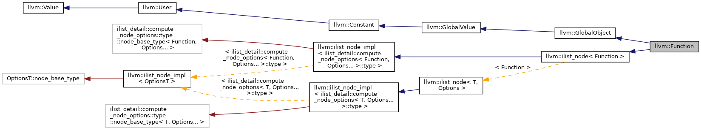

## Tiny C Compiler

### 一、序言

#### 1.1 概述

#### 1.2 开发环境

#### 1.3 文件说明

#### 1.4 成员分工

### 二、词法分析

### 三、语法分析

### 四、语义分析

### 五、生成目标代码

在LLVM的文档中可以找到llvm::Function的继承图：

### 七、总结

在本实验中我设计完成了一个C语言子集的编译器，目前支持：
